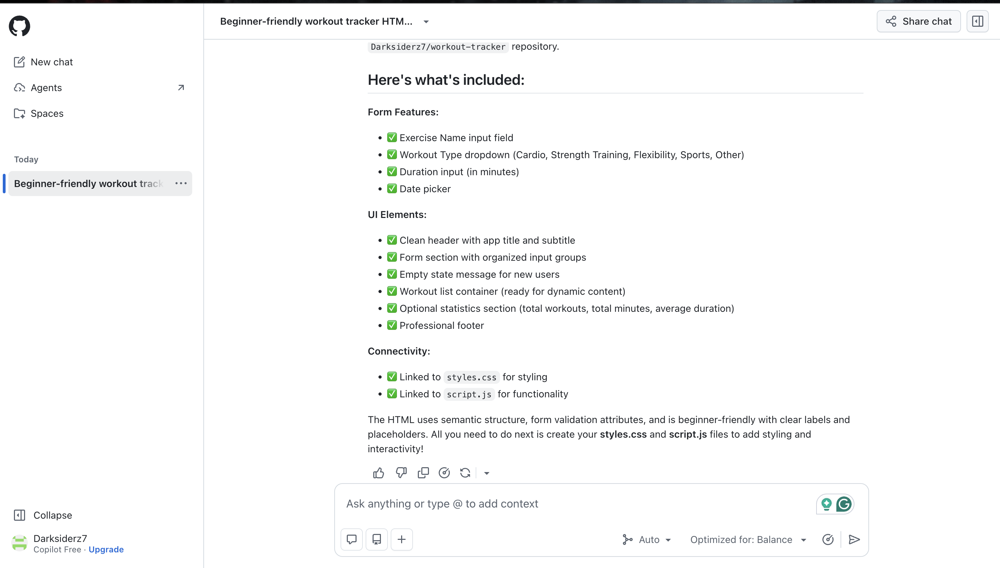
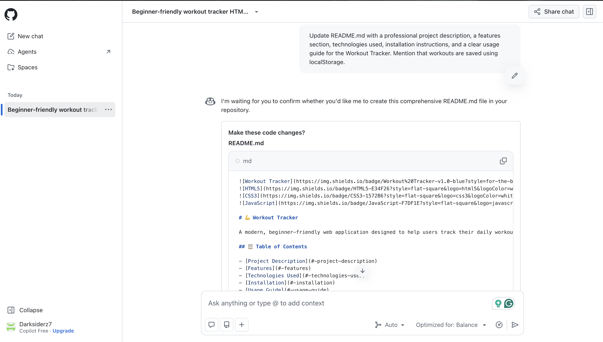
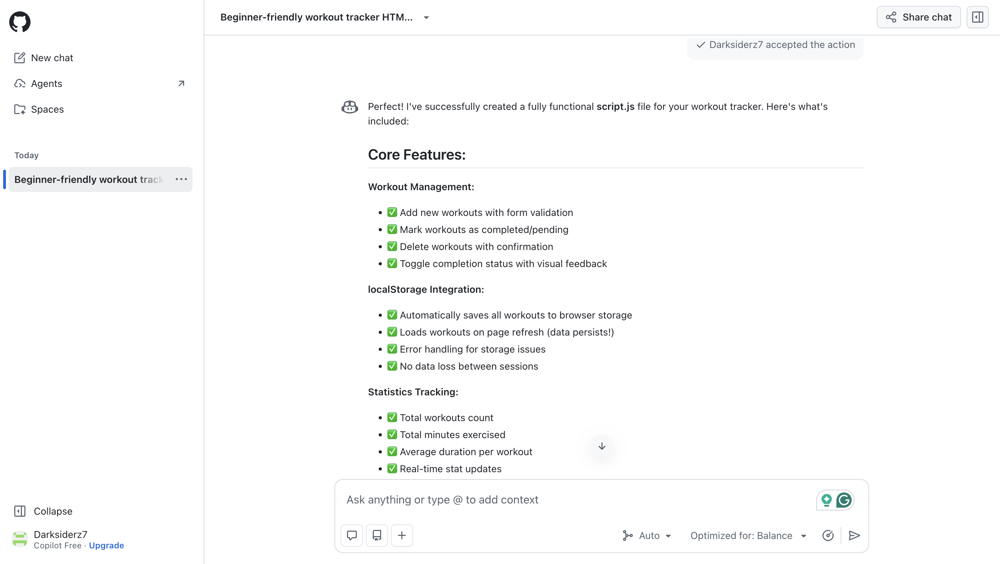

# Reflection: Workout Tracker

## 1. What did I ask Copilot to help me build? How did I break down the problem?

I asked GitHub Copilot to help me create a beginner-friendly workout tracker using HTML, CSS, and JavaScript. The application allows users to enter an exercise, select a workout type, add the duration and date, and save it to a workout list. Users can also mark workouts as complete, delete them, and view basic statistics.

I broke the project into smaller steps. First, I asked Copilot to create the HTML structure. Next, I asked it to design the application with CSS. After that, I requested the JavaScript functionality. Finally, I asked Copilot to create a professional README. Working on one part at a time made the project easier to understand and test.

## 2. How did my approach to asking questions change?

My first prompt was general because I was still deciding how the application should work. As I continued, my prompts became more specific. For example, I asked for a responsive blue-and-green fitness theme and listed the exact JavaScript features I needed.

I learned that Copilot produces better results when the prompt clearly explains the design, features, and expected behavior. Breaking larger requests into smaller ones also made the responses easier to review.

## 3. What surprised me about working with GitHub Copilot?

I was surprised by how quickly Copilot generated a working starting point for each part of the application. It also included helpful details such as input validation, confirmation before deleting a workout, responsive styling, and messages after user actions.

The experience also showed me that AI-generated code still needs review and testing. Copilot sped up development, but I was responsible for checking that the code worked and met my project requirements.

## 4. What did I learn about the technology I used?

I learned how HTML, CSS, and JavaScript work together in a web application. HTML creates the structure, CSS controls the appearance, and JavaScript makes the page interactive. I also learned how Grid, Flexbox, and media queries can make a layout responsive.

JavaScript taught me how to collect form data, respond to button clicks, update the DOM, and store workouts in an array. I also learned that `localStorage` keeps information after the browser refreshes. The application uses `JSON.stringify()` to save the workouts and `JSON.parse()` to load them again.

## 5. What would I do differently next time?

If I built this project again, I would begin with a smaller version and test every feature as soon as it was added. I would first make sure users could add and display workouts before adding completion, deletion, statistics, and localStorage.

I would also spend more time improving accessibility and testing the application on different screen sizes. In a future version, I would add editing, filtering, and more detailed progress tracking.

## Screenshot Evidence

### Screenshot 1: HTML Structure

This interaction shows Copilot creating the HTML structure for the workout form and workout list.

### Screenshot 2: CSS Design

This interaction shows Copilot creating the responsive blue-and-green design.

### Screenshot 3: JavaScript Functionality

This interaction shows Copilot adding the workout functions, statistics, and localStorage.

## Final Reflection

This project helped me understand how to collaborate with GitHub Copilot while building a functional application. Copilot saved time by generating code, but I still had to explain my ideas, review the results, and test the application. I now have a better understanding of how HTML, CSS, JavaScript, DOM manipulation, and localStorage work together.
